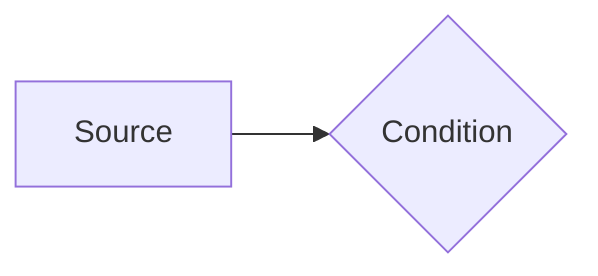
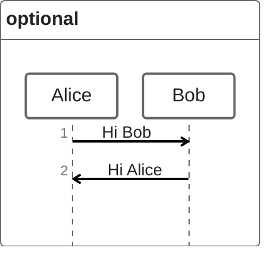
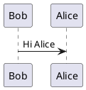

<style>
._ img {
    width: 50vw;
}
* {
    /* width: fit-content; */
}
.flex{
    display:flex;
}
._ {
    display:flex;
    flex-direction: row;
}
.I {
    display:flex;
    flex-direction: column;
}
section{
    padding: 1.5em;
}
figcaption{
    font-size: 20px;
    text-align: center;
}
/* span.hljs-function{
    display:grid;
} */
</style>
<script type="module">
  import mermaid from 'https://cdn.jsdelivr.net/npm/mermaid@10/dist/mermaid.esm.min.mjs';
  mermaid.initialize({ startOnLoad: true });
</script>
<!-- header: "header" -->

# abstract

<div custom-style="Body Text">
<div custom-style="Title">
基于pandoc的markdown转word论文模板
</div><div custom-style="Subtitle">
子标题Subtitle
</div><div custom-style="Author">
专　业：计算机&emsp;&emsp;&emsp;&emsp;&emsp;学　号：20241015  
学生姓名：aclon&emsp;&emsp;&emsp;&emsp;&emsp;指导教师：大张伟
</div><div custom-style="Date">
2025年
</div><div custom-style="Abstract Title">
摘要
</div>

*上面的摘要标题使用了 `custom-style` 而非直接使用 `##` 标题是为了**防止被自动编号**。使用 `{.unnumbered}`/`{-}` 尽管可以实现标题不会被编号，但是下一个标题的编号**仍**然会算上这个标题**继续编号**，所以使用了 `custom-style` 直接指定 Word 样式。*

## 安装 Install
```sh
git clone https://github.com/AClon314/md2doc

wget https://github.com/lierdakil/pandoc-crossref/releases/latest/download/pandoc-crossref-Linux-X64.tar.xz # 自动编号，下载后解压到PATH
npm install -g puppeteer pandoc-mermaid-chartjs-filter
# pnpm approve-builds -g
sudo dnf install giflib-devel # linux依赖：apt install libgif-dev; yay giflib

pip install pandoc-plantuml-filter
sudo dnf install graphviz # 还需要手动安装plantuml，见下方

# pip install pandoc-tex-numbering  # tex → other
```

### plantuml

1. 下载最新包，解压：[windows](https://github.com/plantuml/plantuml/releases/latest)
2. 为`plantuml`(full)或`plantuml-headless`创建软链接到\$PATH，windows下可以是`C:\Windows`，linux下可以是`~/.local/bin`(需要在.bashrc里添加PATH=...:\$PATH)
3. 测试
```
plantuml -version
PlantUML version 1.2025.2 (Wed Jan 08 01:35:36 CST 2025)
(GPLv2 source distribution)
Java Runtime: GraalVM Runtime Environment
JVM: Substrate VM
Default Encoding: UTF-8
Language: null
Country: null
 
PLANTUML_LIMIT_SIZE: 4096

Dot version: dot - graphviz version 12.2.1 (20241206.2353)
Installation seems OK. File generation OK
```

## 用法 Usage
在同目录下运行：
```sh
./convert.py README.md
```
`./convert.py -h` 查看帮助
`./conver.py --diy` 可以导出docx模板，记得再另存为一次。

感谢原教程[@pandoc_template_example]： https://st1020.com/write-thesis-with-markdown-part1/
[@ref_standard]
[@md2pptx]

## 必读文档 Must Read

[default table style 默认表格样式，✅MS-Word，❌WPS](https://github.com/jgm/pandoc/issues/3275#issuecomment-369198726)

[markdown转markdown：\$toc\$自定义目录位置](https://github.com/jgm/pandoc/wiki/Pandoc-Tricks#using-markdown-templates)

[用markdown写论文@geChunYu](https://ge-chunyu.github.io/posts/2019-11-pandoc-large-document/)

[用markdown写论文@st1020](https://st1020.com/write-thesis-with-markdown-part1/)

**关键词：** Markdown；Pandoc

\newpage

<div custom-style="Title">
Based on pandoc word template
</div><div custom-style="Abstract Title">
Abstract
</div>

Write abstract here.

**Key Words:** Markdown; Pandoc

</div>

<br section>

# Heading 1
## Heading 2
### Heading 3
#### Heading 4
##### Heading 5
###### Heading 6
首段落 First Paragraph.
正文Normal, 正文字体Body Text. `Verbatim Char代码字体` [超链接Hyperlink](https://github.com/AClon314 "mouse-over-hint") 脚注Footnote [^1]

[^1]: footnote.

**Bold** _Italic_ ~~Delete~~

1. 有序列表
    1. 11
        1. 111
            1. 1111
                1. 11111
                    1. 111111
    1. 12
1. 2

- 无序列表
  - 11
    - 111
      - 1111
        - 11111
          - 111111
  - 12
- 2

如表[@tbl:table]。如图[@fig:ID]。

| Compact |   b   |
| :-----: | :---: |
|    1    |   2   |
: simple_tables see https://pandoc.org/chunkedhtml-demo/8.9-tables.html {#tbl:table}

::: {custom-style="Figure"}
|   a   |   b   |
| :---: | :---: |
|   1   |   2   |
表{} 表名
:::

{#fig:ID}

<!-- description -->


```{.mermaid format=svg}
%%{init:{"flowchart":{"htmlLabels":false}}}%%
flowchart LR
    A[Source] --> B{Condition}
```





```chartjs
{
  "type": "pie",
  "data": {
    "labels": [
      "Red",
      "Blue",
      "Yellow"
    ],
    "datasets": [
      {
        "data": [
          300,
          50,
          100
        ],
        "backgroundColor": [
          "#FF6384",
          "#36A2EB",
          "#FFCE56"
        ],
        "hoverBackgroundColor": [
          "#FF6384",
          "#36A2EB",
          "#FFCE56"
        ]
      }
    ]
  },
  "options": {}
}
```

```{.py include=convert.py snippet=main .numberLines}
```

> quote

```python {.numberLines}
#!/bin/env python
if __name__ == "__main__":
    print("👻")
```

\newpage

# 参考文献

::: {#refs}
:::
