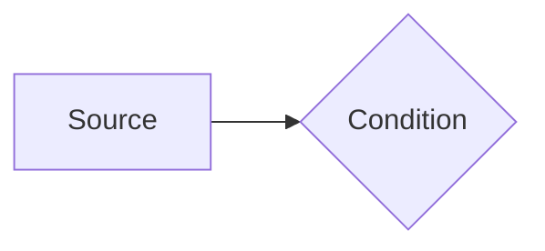
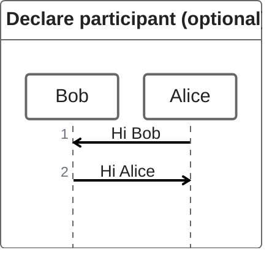
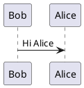

\pagebreak
::: {custom-style="Title"}
| 基于pandoc的markdown转word论文模板
:::
::: {custom-style="Subtitle"}
| 子标题Subtitle
:::
::: {custom-style="Author"}
| 专　业：计算机&emsp;&emsp;&emsp;&emsp;&emsp;学　号：20241015
| 学生姓名：aclon&emsp;&emsp;&emsp;&emsp;&emsp;指导教师：大张伟
:::
::: {custom-style="Date"}
| 2024年
:::
::: {custom-style="Abstract"}
| 摘要
:::

~~上面的摘要标题使用了 `custom-style` 而非直接使用 `##` 标题是为了**防止被自动编号**。使用 `{.unnumbered}`/`{-}` 尽管可以实现标题不会被编号，但是下一个标题的编号**仍**然会算上这个标题**继续编号**，所以使用了 `custom-style` 直接指定 Word 样式。~~

## 安装 Install
```sh
npm install -g pandoc-mermaid-chartjs-filter
sudo dnf install giflib-devel # linux依赖：apt install libgif-dev; yay giflib

pip install pandoc-plantuml-filter
sudo dnf install graphviz plantuml # linux依赖，如果你不想安装plantuml依赖，你可以手动下载.jar包，详见下方

git clone https://github.com/AClon314/md2doc
```

### plantuml.jar
linux系统，windows用户也是类似的。

1. 保证`java`与`graphviz`已安装：`java --version`
2. 手动下载~~最新的~~`plantuml.jar`: https://sourceforge.net/projects/plantuml/files/plantuml.jar/download
3. 在任意属于`$PATH`的路径下创建`plantuml`文件，没有后缀名：
```sh
#!/bin/bash
java -jar $HOME/plantuml.jar "$@"
```
4. 设置执行权限
```sh
chmod +x ~/.local/bin/plantuml
```

## 用法 Usage
在同目录下运行：
```sh
./convert.py README.md
```
`./convert.py -h` 查看帮助
`./conver.py --diy` 可以导出docx模板，记得再另存为一次。

感谢原教程[@pandoc_template_example]： https://st1020.com/write-thesis-with-markdown-part1/
[@ref_standard]
[@md2pptx]

::: {custom-style="Normal"}
| **关键词：** Markdown；Pandoc
:::
\pagebreak

::: {custom-style="Title"}
| Based on pandoc word template
:::
::: {custom-style="Abstract"}
| Abstract
:::

Write abstract here.

::: {custom-style="Normal"}
| **Key Words:** Markdown; Pandoc
:::
\pagebreak

# Heading 1
## Heading 2
### Heading 3
#### Heading 4
##### Heading 5
###### Heading 6
首段落 First Paragraph.
正文Normal, 正文字体Body Text. `Verbatim Char代码字体` [超链接Hyperlink](https://github.com/AClon314 "mouse-over-hint") 脚注Footnote [^1]

[^1]: footnote.

**Bold** _Italic_ ~~Delete~~

\pagebreak

1. 有序列表
    1. 11
        1. 111
            1. 1111
                1. 11111
                    1. 111111
    1. 12
1. 2

\pagebreak
- 无序列表
  - 11
    - 111
      - 1111
        - 11111
          - 111111
  - 12
- 2

|   a   |   b   |
| :---: | :---: |
|   1   |   2   |
: simple_tables see https://pandoc.org/chunkedhtml-demo/8.9-tables.html

<!-- description -->
|   a   |   b   |
| :---: | :---: |
|   1   |   2   |

::: {custom-style="Figure"}
|   a   |   b   |
| :---: | :---: |
|   1   |   2   |
表{} 表名
:::

::: {custom-style="Figure"}

Figure
:::

<!-- description -->


```{.mermaid format=svg}
%%{init:{"flowchart":{"htmlLabels":false}}}%%
flowchart LR
    A[Source] --> B{Condition}
```





```chartjs
{
  "type": "pie",
  "data": {
    "labels": [
      "Red",
      "Blue",
      "Yellow"
    ],
    "datasets": [
      {
        "data": [
          300,
          50,
          100
        ],
        "backgroundColor": [
          "#FF6384",
          "#36A2EB",
          "#FFCE56"
        ],
        "hoverBackgroundColor": [
          "#FF6384",
          "#36A2EB",
          "#FFCE56"
        ]
      }
    ]
  },
  "options": {}
}
```

```python
#!/usr/bin/env python
import os

def main():
    args = parser.parse_args()
    cmd = f"pandoc --defaults={args.defaults} {args.input} -o {args.output}"
    os.system(cmd)

if __name__ == "__main__":
    main()
```

<!-- quote -->
> quote


\pagebreak
::: {custom-style="Abstract"}
| 参考文献
:::
::: {#refs}
:::
